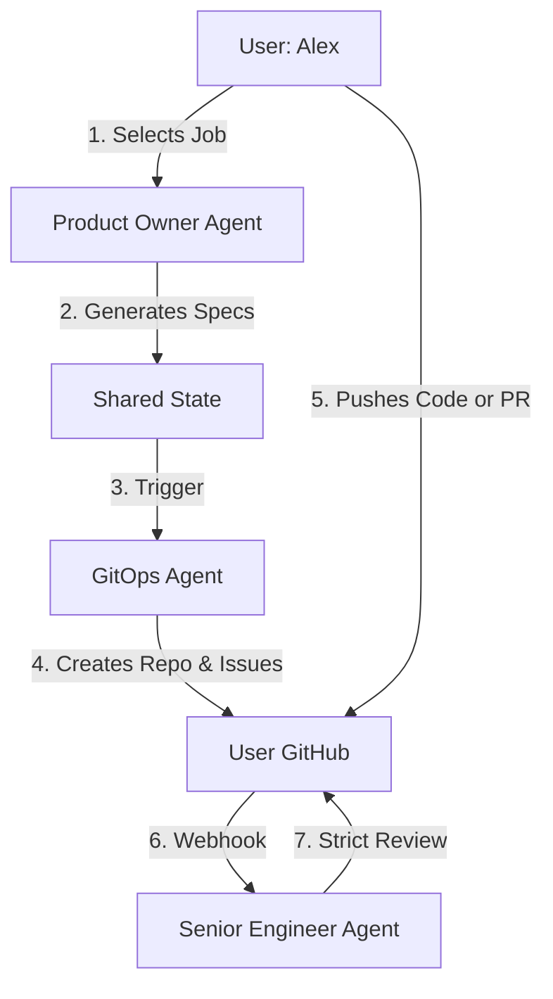

# 🏢 Shadow Workplace: The AI Job Simulator

> **"Stop learning tutorials. Start working a real job."**

Shadow Workplace is an AI-powered simulation engine that mimics a high-pressure software engineering environment. Instead of guiding users through tutorials, it assigns them vague Jira tickets, creates real GitHub repositories, and uses an AI "Senior Engineer" to reject their code if it isn't production-ready.

---

## 🏗 Architecture

The system is built on the **Supervisor-Worker** pattern using **LangGraph**. A central "Brain" orchestrates three specialized agents to simulate a real dev team.



## 🚀 Getting Started

This project is containerized using Docker to ensure a consistent development environment.

### Prerequisites

*   [Docker](https://docs.docker.com/get-docker/)
*   [Docker Compose](https://docs.docker.com/compose/install/)

### Installation

1.  **Clone the repository:**
    ```sh
    git clone https://github.com/your-username/shadow-workplace.git
    cd shadow-workplace
    ```

2.  **Build and run the container:**
    This command will build the Docker image and start the FastAPI application.
    ```sh
    docker-compose up --build
    ```

The application will be running at `http://localhost:8000`.

## Usage

You can interact with the agent workflow through the API.

### Invoke the Agent Workflow

Send a POST request to the `/agent/invoke` endpoint with a prompt.

**Request:**
```bash
curl -X POST "http://localhost:8000/agent/invoke" \
     -H "Content-Type: application/json" \
     -d '{"prompt": "Hello, agent!"}'
```

**Response:**
```json
{
  "status": "success",
  "result": {
    "messages": [
      "Hello, agent!",
      "Manager says hello",
      "DevOps says hello",
      "Senior Dev says hello"
    ]
  }
}
```
